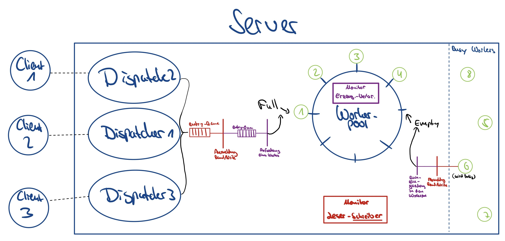

# Testdokumentation: Testat 2
Autor: Alexander Meinecke
E-Mail: alexandermeinecke@icloud.com

## Disclaimer - Bitte lesen

Die Implementation ist ausführlich kommentiert. Um den Code zu testen, bitte Folgendes beachten:

- Ich schreibe die Dateien auf meinem Computer in den Projektordner. In der MyFile-Klasse findet sich eine statische Variable namens 'PATH'. Bitte geben Sie dort das Verzeichnis an, in das geschrieben und gelesen werden soll.
- Intellij generiert statt "class"-Ordner "out"-Ordner. Ich habe trotzdem ein "class"-Ordner erstellt und die Dateien manuell reinkopiert, um die Verzeichnisse, wie sie in der Aufgabenstellung vorgesehen sind, abzugeben.

## Skizzierung des der Umsetzung für das Verständnis der folgenden Testfälle

Wenn der Server eine Nachricht N1 von einem Client empfängt, wird diese erstmal an den Dispatcher weitergegeben. Dieser entschlüsselt
erstmal die Nachricht und wandelt sie in eine Action um (bspw. "WRITE test,1,hallo"). Anschließend spricht der Dispatcher den
Workerpool an und die Operation der Action auf eine bestimmte Datei wird beim ReaderWriterMonitor angemeldet. 
Im Falle von "WRITE", erfolgt die Anmeldung nur, wenn keine aktive READ- oder WRITE-Operation auf die gleiche Datei zugreift.
Wenn die Operationsanmeldung erfolgt ist, wird ein Worker vom Workerpool angefordert. Sofern der Pool nicht leer ist, 
wird der nächste freie Worker über den Full-Pointer identifiziert, as dem Workerpool ausgetragen und an den Dispatcher
zurückgegeben. Dieser übergibt dem zurückgegeben Worker die zu bearbeitende Action und startet ihn. 
Der Dispatcher ist hier dementsprechend der Verbraucher. Wenn der Worker seine Aufgabe abgearbeitet hat, spricht er den Workerpool an, 
damit seine verwendete READ- oder WRITE-Operation auf die genutzte Datei abgemeldet wird und dieser anschließend wieder in den Workerpool eingetragen wird.
Die Worker sind in dieser Hinsicht Erzeuger von freien Workern.



## Testfälle

Im Folgen werden alle für mich relevanten Testfälle dargestellt. Die jeweiligen Ausgaben in der Konsole werden ggf. erläutert.

Hinweis zur Dokumentation: Wichtige Einträge in der Console wurden mit **"=> "** markiert, für bessere Lesbarkeit.

### 1. Testfalle für Kommandos über Client-Textschnittstelle

Folgender Teil der Aufgabenstellung wird hier getestet:
```
Der Server soll als Worker-Pool-Server auf Port 5999 Aufträge in Form von Strings mit ”READ
filename,line no” entgegennehmen, wobei line no eine positive ganze Zahl sein muss. Daraufhin
wird vom Server die Datei filename geöffnet, die Zeile line no ausgelesen und zuru ̈ckgeschickt.
Außerdem soll der Server auch das Kommando ”WRITE filename,line no,data” verstehen, bei
dem die Zeile line no durch data (kann Kommas und Leerzeichen enthalten) ersetzt werden soll.
Falls sich im Basisverzeichnis des Servers keine solche Datei befindet oder keine entsprechende Zeile
vorhanden ist, soll an den Client eine Fehlermeldung zuru ̈ckgesendet werden.
```
Anmerkung: Die MyFile-Klasse kann zusätzlich neue Dateien erzeugen. Beim Schreiben können notfalls weitere Zeilen hinzugefügt werden.

#### 1.1 Testfall - WRITE-Kommando

Client:
```
Enter Message :
WRITE test,1,Ich bin Zeile 1 :)
Waiting for server
=> Server returned: New line content: Ich bin Zeile 1 :)
```

#### 1.2 Testfall - READ-Kommando

Client:
```
Enter Message :
READ test,1
Waiting for server
=> Server returned: Ich bin Zeile 1 :)
```

#### 1.3 Testfall - Negative Zeile

Client: 
```
READ test,-1
Waiting for server
=> Server returned: Line not found
```

#### 1.4 Testfall - PATH ist falsch / Datei existiert nicht (nur für Reader)

Client:
```
READ file_der_nicht_extistiert,1
Waiting for server
=> Server returned: File /Users/I569702/Documents/AdvancedIT/Advanced_IT_Testataufgaben/file_der_nicht_extistiert not found
```

#### 1.5 Testfall - Falsches Format

Client:
```
Enter Message :
WRITE test;neuer inhalt;1
Waiting for server
=> Server returned: Line index not found
Enter Message :
READ test 1
Waiting for server
=> Server returned: File /Users/I569702/Documents/AdvancedIT/Advanced_IT_Testataufgaben/test 1 not found
```

#### 1.6 Testfall - Ungültiges Kommando

Client:
```
Enter Message :
PIZZA test
Waiting for server
=> Server returned: Command not defined.
```

### 2. Testfalle für zweites Leser-Schreiber-Problem

Folgender Teil der Aufgabenstellung wird hier getestet:
```
Achten Sie darauf, dass nebenläufige Zugriffe konsistente Dateien hinterlassen. Implementieren Sie hierzu
das Zweite Leser-Schreiber-Problem (mit Schreiberpriorität) mit dem Java Monitorkonzept!
```

#### 2.1 Testfall - Mehrere Leser auf eine Datei

Mehrere Leser sollten ohne Probleme auf eine Datei zugreifen können, da damit die Datenkonsistenz nicht gefährdet wird.

Durchführung: Zwei "SpamClients" wurden gestartet, die kontinuierlich Lesebefehle auf die gleiche Datei senden.

````
Added new ServerTask to dispatcher
Getting new free worker from worker pool
Registering operation: READ on file test
Trying to start reading operation for test
=> READ-operation on test is registered and is allowed to start.
Returning free worker from worker pool for operation: READ
Dispatching action and client information to returned free worker
Dispatched
=> Worker 2 has started to process Action: READ
Content from test loaded.
Added new ServerTask to dispatcher
Getting new free worker from worker pool
Registering operation: READ on file test
Trying to start reading operation for test
=> READ-operation on test is registered and is allowed to start.
Returning free worker from worker pool for operation: READ
Dispatching action and client information to returned free worker
Dispatched
=> Worker 3 has started to process Action: READ
Content from test loaded.
Worker 2 prepared message for client: Ich bin Zeile 1 :)
Response has been sent
=> Worker  2 has finished and is adding himself back to the worker pool
Unregistering action: READ on file test
Reading operation on test is deleted. All waiting operations are getting notified.
=> Worker 2 has been added back to pool (and the next waiting server tasks will be resumed)
````

Erläuterung: Während Worker 2 noch arbeitet, wird eine neue READ-Operation freigegeben und darf im Worker 3 starten. 

#### 2.2 Testfall - Leser und Schreiber auf eine Datei

Wenn Schreiber auf der Datei aktiv sind, dürfen keine neuen Leser starten, um die Datenkonsistenz zu wahren (Schreiberpriorität).
Andersrum können keine neuen Schreiber starten, wenn **aktive** Leser oder Schreiber mit der Datei arbeiten.

Durchführung: Ein "SpamClient" wurden gestartet, der kontinuierlich Lesebefehle auf die gleiche Datei sendet.
Parallel wird manuell ein Schreibbefehl auf die gleiche Datei über den normalen Client gesendet.
Die künstliche Verzögerung in der MyFile-Klasse für Schreibeoperationen wird auf 10 sek gesetzt.

``` java
//Künstliche Verzögerung für Testfälle:
try {
    sleep(10000);
} catch (InterruptedException e) {
    throw new RuntimeException(e);
}
```

```
Getting new free worker from worker pool
=> Registering operation: WRITE on file test
Trying to start writing operation for test
=> WRITE-Operation waits for reader on file test to finish.
Worker 3 prepared message for client: Ich bin Zeile 1 :)
Response has been sent
Worker  3 has finished and is adding himself back to the worker pool
=> Unregistering action: READ on file test
Reading operation on test is deleted. All waiting operations are getting notified.
Worker 3 has been added back to pool (and the next waiting server tasks will be resumed)
=> WRITE-Operation on test is registered and is allowed to start.
Returning free worker from worker pool for operation: WRITE
Dispatching action and client information to returned free worker
Dispatched
=> Worker 4 has started to process Action: WRITE
Content from test loaded.
Added new ServerTask to dispatcher
Getting new free worker from worker pool
Registering operation: READ on file test
Trying to start reading operation for test
=> READ-Operation waits for writer on file test to finish.
Content from test loaded.
Worker 4 prepared message for client: New line content: Neuer Eintrag
Response has been sent
Worker  4 has finished and is adding himself back to the worker pool
=> Unregistering action: WRITE on file test
Writing operation on test is deleted. All waiting operations are getting notified.
Worker 4 has been added back to pool (and the next waiting server tasks will be resumed)
=> READ-operation on test is registered and is allowed to start.
Returning free worker from worker pool for operation: READ
Dispatching action and client information to returned free worker
Dispatched
Worker 5 has started to process Action: READ
```

Erläuterung: Am Anfang muss bei der Registrierung von WRITE auf Datei test noch auf die verbleibende Leseoperation in Worker 3 gewartet werden.
Nachdem diese abgemeldet wurde, bekommt das WRITE die Starterlaubnis.

#### 2.2.1 Testfall - Leser und Schreiber auf eine Datei mit Hervorhebung der Schreiberpriorität

Um das Vorliegen der Schreiberpriorität nochmal zu verdeutlichen, habe ich mich entschieden einen Testfall zu ergänzen.
Während 


#### 2.3 Testfall - Leser und Schreiber auf unterschiedliche Dateien

Da auf unterschiedlichen Dateien geschrieben und gelesen wird, kann es nicht zu Dateninkonsistenz kommen.

Durchführung: Ein "SpamClient" wurden gestartet, der kontinuierlich Lesebefehle auf die Datei namens 'test' sendet.
Parallel wird manuell ein Schreibbefehl auf Datei 'test1' über den normalen Client gesendet.
Die künstliche Verzögerung in der MyFile-Klasse für Schreiboperationen bleibt bei 10 sek.

``` java
//Künstliche Verzögerung für Testfälle:
try {
    sleep(10000);
} catch (InterruptedException e) {
    throw new RuntimeException(e);
}
```

```
Added new ServerTask to dispatcher
Getting new free worker from worker pool
Registering operation: WRITE on file test1
Trying to start writing operation for test1
=> WRITE-Operation on test1 is registered and is allowed to start.
Returning free worker from worker pool for operation: WRITE
Dispatching action and client information to returned free worker
Dispatched
=> Worker 2 has started to process Action: WRITE
Content from test1 loaded.
Worker 1 prepared message for client: Neuer Eintrag
Response has been sent
=> Worker  1 has finished and is adding himself back to the worker pool
=> Unregistering action: READ on file test
Reading operation on test is deleted. All waiting operations are getting notified.
Worker 1 has been added back to pool (and the next waiting server tasks will be resumed)
Added new ServerTask to dispatcher
Getting new free worker from worker pool
Registering operation: READ on file test
Trying to start reading operation for test
=> READ-operation on test is registered and is allowed to start.
Returning free worker from worker pool for operation: READ
Dispatching action and client information to returned free worker
Dispatched
=> Worker 3 has started to process Action: READ
[8 Sekunden auskommentiert, in dem durchgehen vom "SpamClient" gelesen wurde]
=> Unregistering action: WRITE on file test1
Writing operation on test1 is deleted. All waiting operations are getting notified.
```

Erläuterung: Write-Operation darf ohne weiteres in Worker 2 starten, obwohl Worker 1 offensichtlich die Leseoperation 
für Datei test noch nicht abgemeldet hat. Anschließend wird eine weitere Leseoperation in Worker 3 gestartet, bevor Worker 2
mit dem Schreiben auf Datei test1 fertig ist. Zwei unabhängige Dateien werden also nicht synchronisiert.

#### 2.4 Testfall - Mehrere Schreiber auf eine Datei

Wenn mehrere Schreiber gleichzeitig auf eine Datei zugreifen, kann dies die Datenkonsistenz beeinträchtigen.
Dies sollte vermieden werden.

Durchführung: Zwei "SpamClientWRITE" werden aktiviert, die kontinuierlich auf die gleiche Datei schreiben wollen.
Die künstliche Verzögerung in der MyFile-Klasse für Schreiboperationen wird auf 3 sek gesetzt.

``` java
//Künstliche Verzögerung für Testfälle:
try {
    sleep(3000);
} catch (InterruptedException e) {
    throw new RuntimeException(e);
}
```

```
Added new ServerTask to dispatcher
Getting new free worker from worker pool
Registering operation: WRITE on file test
Trying to start writing operation for test
=> WRITE-Operation on test is registered and is allowed to start.
Returning free worker from worker pool for operation: WRITE
Dispatching action and client information to returned free worker
Dispatched
=> Worker 1 has started to process Action: WRITE
Content from test loaded.
Content from test loaded.
Added new ServerTask to dispatcher
Getting new free worker from worker pool
Registering operation: WRITE on file test
=> Trying to start writing operation for test
=> WRITE-Operation waits for writer on file test to finish.
Worker 1 prepared message for client: New line content: 1
Response has been sent
=> Worker  1 has finished and is adding himself back to the worker pool
=> Unregistering action: WRITE on file test
=> Writing operation on test is deleted. All waiting operations are getting notified.
=> WRITE-Operation on test is registered and is allowed to start.
Worker 1 has been added back to pool (and the next waiting server tasks will be resumed)
Returning free worker from worker pool for operation: WRITE
Dispatching action and client information to returned free worker
Dispatched
Worker 2 has started to process Action: WRITE
```

Erläuterung: Nach dem die erste WRITE-Operation registriert wurde und in Worker 1 startet, 
muss bei der nächten WRITE-Registrierung gewartet werden, bis die WRITE-Operation wieder abgemeldet wurde.

### 3. Testfälle für Erzeuger-Verbraucher-Problem


